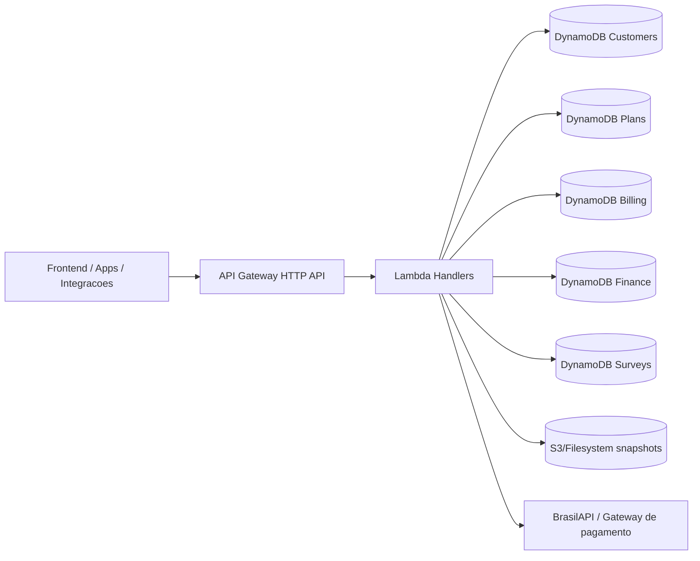
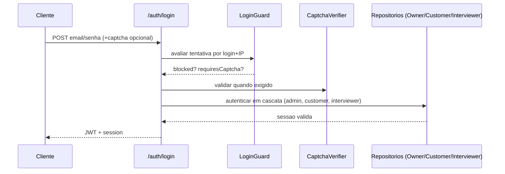
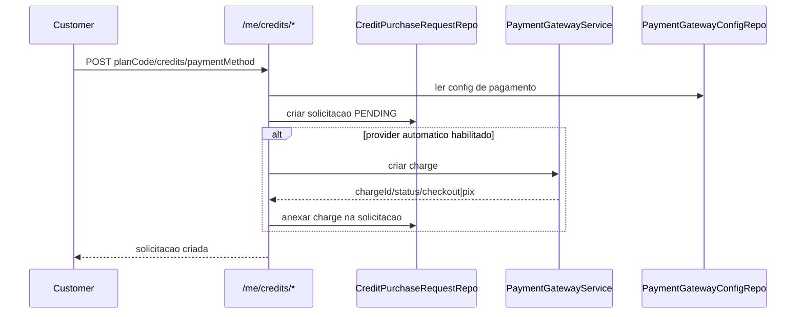
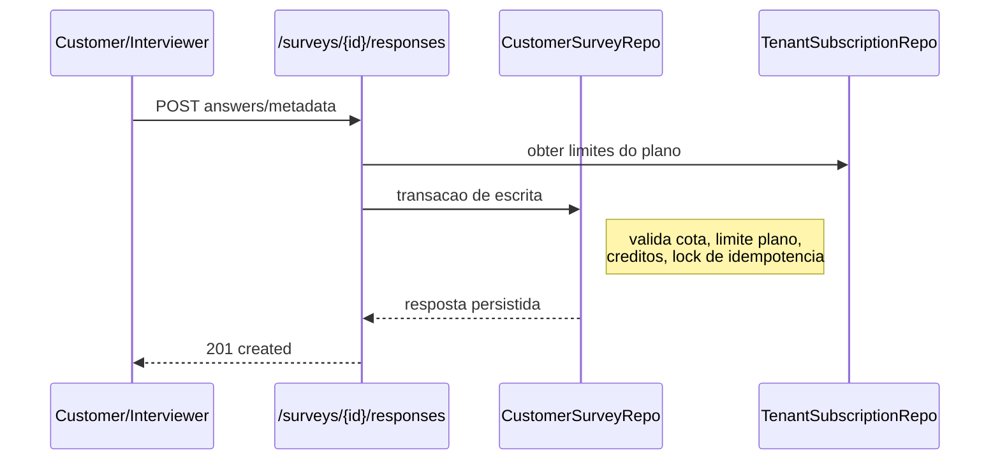

# Insights BFF (Backend)

Backend serverless da plataforma Insights (BFF HTTP API) com foco em:
- autenticacao/autorizacao multi-perfil;
- operacao de pesquisas de campo (survey, respostas, heatmap, resumo);
- administracao SaaS (clientes, planos, usuarios, faturamento e financeiro);
- configuracao de frontend e catalogo publico;
- integracoes externas (BrasilAPI, gateways de pagamento/webhooks).

## Sumario

1. [Visao geral](#visao-geral)
2. [Arquitetura](#arquitetura)
3. [Consumo de dados](#consumo-de-dados)
4. [Reducao de custos](#reducao-de-custos)
5. [Seguranca transacional](#seguranca-transacional)
6. [Fluxos principais](#fluxos-principais)
7. [Modelo de dados (DynamoDB)](#modelo-de-dados-dynamodb)
8. [API HTTP](#api-http)
9. [Autenticacao e autorizacao](#autenticacao-e-autorizacao)
10. [Setup local](#setup-local)
11. [Configuracoes e ambientes](#configuracoes-e-ambientes)
12. [Deploy](#deploy)
13. [Operacao e troubleshooting](#operacao-e-troubleshooting)

## Visao geral

- Runtime: `Node.js 20.x`
- Framework de deploy: `Serverless Framework v3`
- API: `AWS API Gateway HTTP API`
- Computacao: `AWS Lambda`
- Persistencia: `DynamoDB` (5 tabelas logicas)
- Armazenamento analitico: filesystem ou S3 (inclui MinIO no local)
- Documentacao OpenAPI: gerada automaticamente a partir de schemas `zod`

Dominios funcionais:
- `Auth`: cadastro, login, guard de tentativas, captcha.
- `Customer`: perfil, credito, entrevistadores, surveys.
- `Interviewer`: surveys disponiveis.
- `Admin`: clientes, planos, usuarios, cobranca, financeiro.
- `Public`: catalogo e configuracoes de frontend.
- `Integrations/Webhooks`: BrasilAPI e callbacks de pagamento.

## Arquitetura

### Camadas

```text
src/
  core/                     # regras e tipos de dominio
  application/              # portas (contratos)
  infrastructure/           # persistencia, seguranca, analytics, pagamentos
  interfaces/http/          # handlers HTTP, middlewares, docs/openapi
  shared/                   # codigos e normalizadores compartilhados
```

### Estilo

- BFF orientado a handlers serverless (um handler por endpoint).
- Repositorios DynamoDB por contexto de negocio.
- Middlewares internos de app-token e auth JWT.
- Spec OpenAPI gerada por `zod` + `@asteasolutions/zod-to-openapi`.

### Topologia de execucao



## Consumo de dados

### Perfil de leitura/escrita por dominio

- `surveys`: maior volume de escrita (submissao de respostas), com leitura para listagens, heatmap e analytics.
- `billing`: escrita moderada (solicitacoes, status de pagamento, revisao admin) e leitura de relatorios.
- `finance`: leitura intensa para dashboards e filtros mensais; escrita em criacao/atualizacao de despesas e templates.
- `customers/plans`: leitura frequente em auth e resolucao de assinatura/plano; escrita pontual em cadastro e administracao.

### Como os dados de analytics sao consumidos

Pipeline implementado:
- respostas recentes ficam no DynamoDB (`SURVEY#.../RESPONSE#...`);
- respostas elegiveis sao arquivadas em chunks compactados (`gzip`) no filesystem/S3;
- snapshots de analytics sao recalculados sob demanda e cacheados por versao (`responsesCount:updatedAt`).

Pontos importantes:
- `ANALYTICS_ARCHIVE_SAFETY_LAG_SECONDS`: evita mover respostas muito recentes.
- `ANALYTICS_ARCHIVE_CHUNK_SIZE`: controla tamanho dos lotes arquivados.
- heatmap final combina pontos arquivados + pontos ativos.

### Indices e padroes de acesso

- GSIs por entidade para listagens administrativas (`ENTITY#...`).
- GSI3 em financeiro para recorte mensal/status de despesas.
- locks dedicados para deduplicacao e lookup rapido (email lock, response lock, charge lookup).

## Reducao de custos

### DynamoDB

Ja adotado:
- `PAY_PER_REQUEST` em todas as tabelas.
- consultas por chave/GSI (sem scans pesados no fluxo principal).
- TTL habilitado nas tabelas para expurgo automatizado de itens com `ttlEpoch`.

Recomendacoes adicionais:
- monitorar itens grandes em `answers/metadata` e reduzir campos nao essenciais.
- manter filtros por prefixo de chave e evitar leitura ampla por `GSI2` sem paginação.
- revisar periodicamente cardinalidade de chaves quentes (principalmente `SURVEY#...`).

### Lambda/APIGateway

Ja adotado:
- handlers simples e stateless.
- build com esbuild bundling.

Recomendacoes adicionais:
- ajustar memoria por função critica (submissao de respostas, relatorios) para reduzir tempo de execucao total.
- usar caching no cliente para endpoints de leitura pesada (catalogo, settings publicas).
- paginação obrigatoria em listas administrativas grandes.

### Analytics e Storage

Ja adotado:
- offload de respostas antigas para arquivo compactado (`.json.gz`).
- snapshots versionados para evitar recomputacao desnecessaria.

Recomendacoes adicionais:
- mover obrigatoriamente `ANALYTICS_SNAPSHOT_STORAGE=s3` em ambientes produtivos.
- aplicar lifecycle no bucket de analytics (transicao/expurgo por idade).
- medir custo de leitura de chunks por survey com alto volume e ajustar `ANALYTICS_ARCHIVE_CHUNK_SIZE`.

## Seguranca transacional

### Atomicidade e concorrencia

O backend usa `TransactWrite` + `ConditionExpression` para proteger estado em cenarios concorrentes.

Exemplos implementados:
- cadastro: lock de email/documento + criacao de tenant/user no mesmo commit.
- submissao de resposta:
  - lock por `clientResponseId` (idempotencia),
  - decremento de credito do tenant,
  - incremento de contadores de cota,
  - insercao da resposta,
  tudo na mesma transacao.
- revisao de solicitacao de credito:
  - aprovacao/rejeicao condicionada ao estado pendente,
  - evita dupla revisao por admins concorrentes.

### Idempotencia

- respostas de survey: `RESPONSE_LOCK#{clientResponseId}` impede duplicidade.
- webhooks de pagamento: atualizacao por `provider + chargeId` com lookup dedicado.

### Controles de autenticacao/autorizacao

- dupla camada (`X-App-Token` + JWT) para rotas protegidas.
- matriz de permissao admin por path/metodo no middleware.
- login guard por IP+login com bloqueio temporario e captcha progressivo.

### Integridade de webhook

- exige token `X-Webhook-Token` comparado com segredo configurado por produto.
- rejeita provider/chargeId invalidos antes de mutacao de estado.

## Fluxos principais

### 1) Login



### 2) Compra/Solicitacao de creditos



### 3) Submissao de resposta de survey



## Modelo de dados (DynamoDB)

O servico usa abordagem single-table por dominio/tabela, com chaves compostas e GSIs.

### Tabelas

- `customers` (`insights-customers-*`)
- `plans` (`insights-plans-*`)
- `billing` (`insights-billing-*`)
- `finance` (`insights-finance-*`)
- `surveys` (`insights-surveys-*`)

### Padrao de chaves por dominio (resumo)

#### Customers
- Tenant profile: `PK=TENANT#{tenantId}`, `SK=PROFILE`
- User profile: `PK=USER#{userId}`, `SK=PROFILE`
- Locks:
  - email: `PK=USEREMAIL#{email}`, `SK=LOCK`
  - documento: `PK=TENANTDOC#{document}`, `SK=LOCK`
- GSI2 para listagens de entidade/tenant/user.

#### Plans
- Plan definition: `PK=PLANDEF#{planId}`, `SK=PROFILE`
- Code lock: `PK=PLANDEF_CODE#{productCode}#{code}`, `SK=LOCK`
- Auditoria: `PK=PLANDEF#{planId}`, `SK=AUDIT#{createdAt}#{auditId}`
- Usuarios admin owner:
  - profile: `PK=OWNER_USER#{userId}`, `SK=PROFILE`
  - email lock: `PK=OWNER_USER_EMAIL#{email}`, `SK=LOCK`

#### Billing
- Credit request: `PK=TENANT#{tenantId}`, `SK=CREDIT_REQUEST#{timestamp}#{id}`
- Request lock: `PK=CREDIT_REQUEST#{id}`, `SK=LOCK`
- Lookup de charge: `PK=PAYMENT_CHARGE#{provider}#{chargeId}`, `SK=REQUEST`
- Payment config por produto: `PK=PRODUCT#{productCode}`, `SK=PAYMENT_CONFIG`

#### Finance
- Supplier: `PK=FINANCE#SUPPLIER#{id}`, `SK=PROFILE`
- Expense: `PK=FINANCE#EXPENSE#{id}`, `SK=PROFILE`
- Forecast: `PK=FINANCE#FORECAST#{yyyy-mm}`, `SK=PROFILE`
- Recurring template: `PK=FINANCE#TEMPLATE#{id}`, `SK=PROFILE`
- Instancia de template: `PK=FINANCE#TEMPLATE#{id}`, `SK=INSTANCE#{yyyy-mm}`
- GSI3 usado para filtro mensal/status de despesas.

#### Surveys
- Survey: `PK=TENANT#{tenantId}`, `SK=SURVEY#{surveyId}`
- Interviewer: `PK=TENANT#{tenantId}`, `SK=INTERVIEWER#{id}`
- Response: `PK=SURVEY#{surveyId}`, `SK=RESPONSE#{submittedAt}#{responseId}`
- Response lock (idempotencia): `PK=SURVEY#{surveyId}`, `SK=RESPONSE_LOCK#{clientResponseId}`
- Counters:
  - entrevistador: `SK=COUNTER#INTERVIEWER#...`
  - quota: `SK=COUNTER#QUOTA#...`

## API HTTP

### Swagger/OpenAPI

- Swagger UI: `GET /docs`
- OpenAPI JSON: `GET /docs/openapi.json`

Detalhes: [`docs/swagger.md`](./docs/swagger.md)

### Grupos de endpoint

- `Auth`: `/auth/register`, `/auth/login`
- `Me/Customer`: `/me`, `/me/credits/*`
- `Interviewers`: `/interviewers*`
- `Surveys`: `/surveys*`
- `Interviewer`: `/interviewer/surveys`
- `Admin`: `/admin/*` (clientes, creditos, pagamentos, planos, usuarios, financeiro, frontend)
- `Public`: `/plans/catalog`, `/frontend/settings`
- `Integrations`: `/integrations/brasilapi/*`
- `Webhooks`: `/webhooks/payments/{provider}`
- `Health`: `/health`

Observacao:
- A especificacao e gerada automaticamente via schemas `zod` (`src/interfaces/http/docs/schemas.ts`).

## Autenticacao e autorizacao

### Camadas de protecao

1. `X-App-Token` (header obrigatorio para rotas protegidas e algumas publicas selecionadas).
2. JWT Bearer (`Authorization: Bearer <token>`) para rotas autenticadas.
3. Permissao administrativa por rota (`ROLE_ADMIN` + permission matrix no middleware).

### Perfis

- `ROLE_CUSTOMER`
- `ROLE_INTERVIEWER`
- `ROLE_ADMIN`

### Permissoes admin (exemplos)

- `USERS_READ/WRITE`
- `CUSTOMERS_READ/WRITE`
- `PLANS_READ/WRITE`
- `BILLING_READ/BILLING_REVIEW`
- `FINANCE_READ/WRITE`
- `PAYMENTS_CONFIG_READ/WRITE`

## Setup local

### Pre-requisitos

- Node.js >= 20
- Docker + Docker Compose

### 1) Configurar ambiente

```bash
cp .env.example .env.local
```

### 2) Subir infraestrutura local

```bash
npm run local:infra
```

Servicos:
- DynamoDB local: `http://localhost:8000`
- DynamoDB Admin UI: `http://localhost:8001`
- MinIO API: `http://localhost:9000`
- MinIO Console: `http://localhost:9001`

### 3) Criar tabelas

```bash
npm run local:create
```

### 4) Popular dados iniciais (admin, planos, cliente, survey)

```bash
npm run local:seed
```

### 5) Rodar API local

```bash
npm run dev
```

API local: `http://localhost:3001`

## Configuracoes e ambientes

Arquivos principais:
- `config/stages.yml`
- `.env.*`
- `serverless.yml`

Stages suportados:
- `local`
- `pet`
- `dev`
- `prd`

Variaveis relevantes:
- seguranca: `JWT_SECRET`, `APP_CLIENT_TOKEN`, `APP_CLIENT_TOKEN_PREVIOUS`
- auth hardening: `LOGIN_*`, `CAPTCHA_*`
- storage analytics: `ANALYTICS_SNAPSHOT_*`
- tabelas: `DYNAMODB_*_TABLE_NAME`

## Deploy

### Manual

```bash
npm run deploy:pet
npm run deploy:dev
npm run deploy:prd
```

### Informacoes da stack

```bash
npm run info:pet
npm run info:dev
npm run info:prd
```

### CI/CD (GitHub Actions + OIDC)

Guia completo: [`docs/github-actions-aws.md`](./docs/github-actions-aws.md)

## Operacao e troubleshooting

### Verificacoes rapidas

- Health check: `GET /health`
- Swagger: `GET /docs`
- OpenAPI: `GET /docs/openapi.json`

### Problemas comuns

1. `401 Unauthorized`
- validar `Authorization` e expiracao do JWT;
- validar `X-App-Token`.

2. `403 Forbidden` em `/admin/*`
- usuario admin sem permissao necessaria para o path/metodo.

3. Falha de swagger em custom domain com prefixo
- o handler de docs resolve path base via `x-forwarded-prefix`;
- validar mapeamento de custom domain no API Gateway.

4. Falha em submits de survey (422)
- limite de plano, quota de entrevistador/quota de pergunta, ou saldo de creditos.

5. Financeiro sem resultados mensais
- conferir GSI3 (ambientes antigos podem cair em fallback de leitura completa).

## Scripts uteis

- `npm run dev`: serverless offline
- `npm run build`: compilacao TS
- `npm run typecheck`: checagem de tipos
- `npm run lint`: lint
- `npm run local:infra`: sobe DynamoDB/MinIO local
- `npm run local:create`: cria tabelas locais
- `npm run local:seed`: popular dados locais

## Observacoes finais

- Este backend usa estrategia de baixo acoplamento por handler/repository, favorecendo evolucao incremental.
- Recomenda-se manter `schemas.ts` como fonte unica de contratos HTTP para evitar divergencia entre validacao e OpenAPI.
